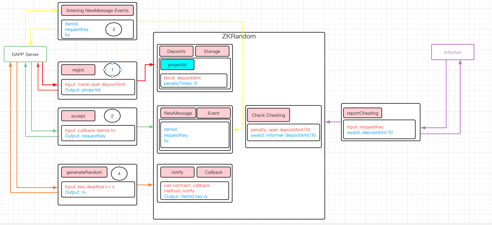

总共有4个角色，分别是zkRandom、DAPP开发商、DAPP用户、监管人员

## ZKRandom 服务商
- ZKRandom合约部署方
- 通过质押管理，提供DAPP开发商服务注册功能
- 服务注册后，提供随机数预获取和随机数获取以及私钥公布的方法
- 同时提供监管接口，允许所有用户举报失信DAPP开发商，以获取举报奖励

## DAPP开发商
- DAPP开发用户或团体，通过向ZKRandom合约质押token注册随机数获取服务
- 调用ZKRandom合约获取随机数后，将随机数根据自身业务需求进行使用
- 超过ZKRandom合约规定时效没有正常调用服务的情况，将被举报进行惩罚

## DAPP用户
- 某个DAPP开发商下的用户
- 主动发起预获取随机数请求，调用预获取随机数接口

## 监管人员
- 举报超时未处理随机数调用的DAPP开发商，举报成功能获取DAPP开发商质押金额10%的奖励

# 工作流程

1. DAPP开发商向ZKRandom服务商质押Token，注册项目
2. DAPP用户对自己的业务数据进行签名，然后将业务数据和签名凭证发放给ZKRandom合约进行预登记;ZKRandom合约验证业务 Hash、随机数凭证的有效性，验证通过后生成requestKey，发出NewMessage事件
3. DAPP开发商监听NewMessage事件，获取requestKey，准备向ZKRandom服务商发起请求，获取随机数rv
4. ZKRandom合约收到DAPP开发商获取随机数请求后，生成随机数，调用DAPP开发商提供的回调地址notify接口返回随机数rv
5. 如果任何人发现DAPP开发商作弊，都可以举报开发商，举报者将获得DAPP开发商质押的10%的Token作为奖励